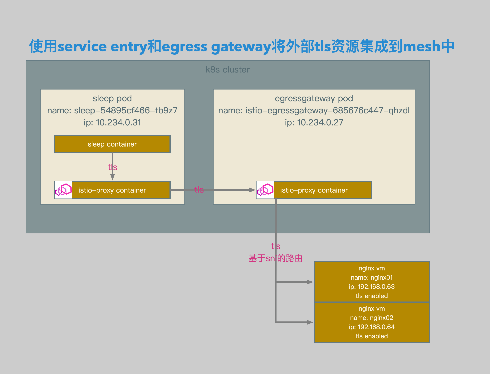

# Istio数据面配置解析02：在Egress Gateway中对基于sniHosts的TLS请求进行路由

## 概述

本文介绍了在Isito中直接转发TLS请求的场景：Mesh内部服务通过Service Entry和Egress Gateway访问外部的TLS服务。

TLS类型的路由属于TCP，所以无Envoy route相关配置，路由均在listener中进行。

本文也为了对TCP类型的路由在Envoy中的配置进行一些解析。


## 相关拓扑



- sleep pod中的sleep container发送相关tls请求。
- 请求被sleep pod中的istio-proxy container截获，并根据路由规则转发至egressgateway pod。
- egressgateway中的istio-proxy container根据相关snihosts路由规则将请求转发至相关外部服务。


- 因为tls类型的路由属于tcp，所以无envoy route相关配置，路由均在listener中进行。
- 使用istio serviceentry定义外部的nginx服务到envoy cluster和endpoint中的节点。
- 两个节点分别对应nginx01 vm和nginx02 vm。
- 为外部的nginx服务在serviceentry中定义label。
- 使用istio destinationrule为不同的label定义不同的subset。
- 在mesh中使用istio virtualservice定义所有到*.nginx.external.istio的请求均被路由至egressgateway。
- 使用istio gateway定义egressgateway接收443端口的请求。
- 将egressgateway的443端口的tls策略设置为passthrough。
- 在egressgateway中使用istio virtualservice定义到两个节点的基于tls的envoy route。
- 指定sni名称为*.v1.nginx.external.istio的请求被路由到nginx01。
- 指定sni名称为*.v2.nginx.external.istio的请求被路由到nginx02。


## 相关配置

###  ServiceEntry和DestinationRule

```yaml
apiVersion: networking.istio.io/v1alpha3
kind: ServiceEntry
metadata:
  name: se-sni
spec:
  hosts:
  - "*.nginx.external.istio"
  ports:
  - number: 443
    name: https
    protocol: HTTPS
  location: MESH_EXTERNAL
  resolution: STATIC
  endpoints:
  - address: 192.168.0.63
    ports:
      https: 443
    labels:
      version: v1
  - address: 192.168.0.64
    ports:
      https: 443
    labels:
      version: v2
```

- serviceentry相关配置。
- 在serviceentry中定义cluster的fqdn为*.nginx.external.istio。
- 为serviceentry添加2个endpoint，分别为192.168.0.63的443端口，和192.168.0.64的443端口。
- 192.168.0.63的label定义为version: v1。
- 192.168.0.64的label定义为version: v2。


```yaml
apiVersion: networking.istio.io/v1alpha3
kind: DestinationRule
metadata:
  name: dr-sni
spec:
  host: "*.nginx.external.istio"
  subsets:
  - name: v1
    labels:
      version: v1
  - name: v2
    labels:
      version: v2
```

- destinationrule相关配置。
- 为cluster *.nginx.external.istio定义subset。
- 将label为version: v1的endpoint定义为subset v1。
- 将label为version: v2的endpoint定义为subset v2。


```json
{
        "name": "outbound|443|v1|*.nginx.external.istio",
        "type": "EDS",
        "edsClusterConfig": {
            "edsConfig": {
                "ads": {}
            },
            "serviceName": "outbound|443|v1|*.nginx.external.istio"
        },
        "connectTimeout": "1.000s",
        "circuitBreakers": {
            "thresholds": [
                {}
            ]
        }
    }


{
        "name": "outbound|443|v2|*.nginx.external.istio",
        "type": "EDS",
        "edsClusterConfig": {
            "edsConfig": {
                "ads": {}
            },
            "serviceName": "outbound|443|v2|*.nginx.external.istio"
        },
        "connectTimeout": "1.000s",
        "circuitBreakers": {
            "thresholds": [
                {}
            ]
        }
    }
```

- envoy cluster相关配置。
- 在serviceentry和destinationrule定义完成后，envoy会生成2个subset相关的cluster，分别为outbound|443|v1|\*.nginx.external.istio和outbound|443|v2|\*.nginx.external.istio。


```json
{"svc": "*.nginx.external.istio:https", "ep": [
{
    "endpoint": {
      "Family": 0,
      "Address": "192.168.0.63",
      "Port": 443,
      "ServicePort": {
        "name": "https",
        "port": 443,
        "protocol": "HTTPS"
      },
…
    "labels": {
      "version": "v1"
    }
…
{
    "endpoint": {
      "Family": 0,
      "Address": "192.168.0.64",
      "Port": 443,
      "ServicePort": {
        "name": "https",
        "port": 443,
        "protocol": "HTTPS"
      },
…
    "labels": {
      "version": "v2"
    }
```

- envoy endpoint相关配置。
- 这2个cluster会与envoy endpoint相关联。


### Mesh层面VirtualService

```yaml
apiVersion: networking.istio.io/v1alpha3
kind: VirtualService
metadata:
  name: vs-sni-mesh
spec:
  hosts:
  - "*.nginx.external.istio"
  tls:
  - match:
    - sniHosts:
      - "*.nginx.external.istio"
      port: 443
    route:
    - destination:
        host: istio-egressgateway.istio-system.svc.cluster.local
        port:
          number: 443
```

- mesh层面virtualservice相关配置。
- virtualservice的路由类型为tls。
- 将所有到*.nginx.external.istio的443端口的请求全部转发至istio-egressgateway.istio-system.svc.cluster.local，也就是istio的egress gateway。


```json
{
        "name": "0.0.0.0_443",
        "address": {
            "socketAddress": {
                "address": "0.0.0.0",
                "portValue": 443
            }
        },
        "filterChains": [
            {
                "filterChainMatch": {
                    "serverNames": [
                        "*.nginx.external.istio"
                    ]
                },
…
                    {
                        "name": "envoy.tcp_proxy",
                        "config": {
                            "cluster": "outbound|443||istio-egressgateway.istio-system.svc.cluster.local",
                            "stat_prefix": "outbound|443||istio-egressgateway.istio-system.svc.cluster.local"
                        }
                    }
```

- envoy listener相关配置。
- 因为virtualservice类型为tls，所以路由会在listener中直接进行。
- envoy listener的filterchain会将所有servername为*.nginx.external.istio的请求全部转发至outbound|443||istio-egressgateway.istio-system.svc.cluster.local这个cluster。


### Gateway和Gateway层面VirtualService

```yaml
apiVersion: networking.istio.io/v1alpha3
kind: Gateway
metadata:
  name: gw-sni
spec:
  selector:
    istio: egressgateway
  servers:
  - port:
      number: 443
      name: https
      protocol: HTTPS
    tls:
      mode: PASSTHROUGH
    hosts:
    - "*"
```

- gateway相关配置。
- 为egress gateway设置监听。
- 打开egress gateway的443端口进行监听，端口类型为https。
- tls类型为passthrough。
- 所有host均可以注册到这个监听。


```yaml
apiVersion: networking.istio.io/v1alpha3
kind: VirtualService
metadata:
  name: vs-sni-gw
spec:
  hosts:
  - "*.v1.nginx.external.istio"
  - "*.v2.nginx.external.istio"
  gateways:
  - gw-sni
  tls:
  - match:
    - sniHosts:
      - "*.v1.nginx.external.istio"
    route:
    - destination:
        host: "*.nginx.external.istio"
        port: 
          number: 443
        subset: v1
  - match:
    - sniHosts:
      - "*.v2.nginx.external.istio"
    route:
    - destination:
        host: "*.nginx.external.istio"
        port: 
          number: 443
        subset: v2
```

- egress gateway层面virtualservice相关配置。
- egress gateway在接收到mesh内部的请求后，按照sni的信息，对请求进行路由。
- sni为\*.v1.nginx.external.istio的443端口的请求，被转发至\*.nginx.external.istio的v1版本的443端口。
- sni为\*.v2.nginx.external.istio的443端口的请求，被转发至\*.nginx.external.istio的v2版本的443端口。


```json
{
        "name": "0.0.0.0_443",
        "address": {
            "socketAddress": {
                "address": "0.0.0.0",
                "portValue": 443
            }
        },
        "filterChains": [
            {
                "filterChainMatch": {
                    "serverNames": [
                        "*.v1.nginx.external.istio"
                    ]
                },
…
                    {
                        "name": "envoy.tcp_proxy",
                        "config": {
                            "cluster": "outbound|443|v1|*.nginx.external.istio",
                            "stat_prefix": "outbound|443|v1|*.nginx.external.istio"
                        }
                    }
…
            {
                "filterChainMatch": {
                    "serverNames": [
                        "*.v2.nginx.external.istio"
                    ]
                },
…
                    {
                        "name": "envoy.tcp_proxy",
                        "config": {
                            "cluster": "outbound|443|v2|*.nginx.external.istio",
                            "stat_prefix": "outbound|443|v2|*.nginx.external.istio"
                        }
                    }
```

- egress gateway envoy listener相关配置。
- 因为virtualservice类型为tls，所以路由会在listener中直接进行。
- egress gateway envoy listener的filterchain会将servername为\*.v1.nginx.external.istio的请求全部转发至outbound|443|v1|\*.nginx.external.istio这个cluster。
- egress gateway envoy listener的filterchain会将servername为\*.v2.nginx.external.istio的请求全部转发至outbound|443|v2|\*.nginx.external.istio这个cluster。


## 测试结果

```bash
/ # curl https://api.v1.nginx.external.istio --resolve api.v1.nginx.external.istio:443:10.235.0.11 -k
<!DOCTYPE html>
<html>
<head>
<title>Welcome to nginx!</title>
<style>
    body {
        width: 35em;
        margin: 0 auto;
        font-family: Tahoma, Verdana, Arial, sans-serif;
    }
</style>
</head>
<body>
<h1>Welcome to nginx!</h1>
<h1>first!</h1>
<p>If you see this page, the nginx web server is successfully installed and
working. Further configuration is required.</p>

<p>For online documentation and support please refer to
<a href="http://nginx.org/">nginx.org</a>.<br/>
Commercial support is available at
<a href="http://nginx.com/">nginx.com</a>.</p>

<p><em>Thank you for using nginx.</em></p>
</body>
</html>
/ #

/ # curl https://api.v2.nginx.external.istio --resolve api.v2.nginx.external.istio:443:10.235.0.11 -k
<!DOCTYPE html>
<html>
<head>
<title>Welcome to nginx!</title>
<style>
    body {
        width: 35em;
        margin: 0 auto;
        font-family: Tahoma, Verdana, Arial, sans-serif;
    }
</style>
</head>
<body>
<h1>Welcome to nginx!</h1>
<h1>second!</h1>
<p>If you see this page, the nginx web server is successfully installed and
working. Further configuration is required.</p>

<p>For online documentation and support please refer to
<a href="http://nginx.org/">nginx.org</a>.<br/>
Commercial support is available at
<a href="http://nginx.com/">nginx.com</a>.</p>

<p><em>Thank you for using nginx.</em></p>
</body>
</html>
/ #
```

- 测试结果。

- 到api.v1.nginx.external.istio的请求被正确转发至nginx01。
- 到api.v2.nginx.external.istio的请求被正确转发至nginx02。